# ARI2204 - Reinforcement Learning

Saul Vassallo and Nick Gerty

## Project Structure

Our project is structured as follows:

### Base Directory

This includes the following files:

1. main.py
   - Main file from which the project is run.
2. evaluation.py
   - File containing helper functions used throughout the evaluation process.
3. plots.py
   - Contains functions used to plot data gathered during the evaluation process.
4. requirements.txt
   - Contains the packages required to run our code in a virtual environment.
5. playBlackjack:).py
   - Contains code allowing us to play our blackjack game for fun...

The base directory also includes the following subdirectories:

1. agents
   - For files containing agent classes.
2. game_structure
   - For files containing classes relevant to the structure of the blackjack game itself.

## Game Structure

The blackjack game is playable through a class in the file game_structure/Blackjack.py. The class uses other classes such as Hand, Card, and Deck to make the game playable. It implements methods that allow different agents to play and learn from the game.

Different methods were necessary since the Monte Carlo algorithm updates its Q-Values at a different point in the round compared to the SARSA and Q-Learning algorithms.

## General Agent Structure

The _MonteCarlo_, _Sarsa_ and _QLearning_ classes all inherit from _AgentABC_. The abstract base class defines the following global constants that are used throughout the project.

### Global Variables

```python
STAND = 0
HIT = 1

LOSS = -1
WIN = 1
DRAW = 0

RANDOM = 0
BEST = 1
```

### Class Variables

The _AgentABC_ defines the following class variables for all the different inheriting algorithms:

```python
self.state = ()
self.epsilon_method = epsilon_method
self.episodes = 0
if current_episode is None:
    current_episode = []
self.current_episode = current_episode
self.state_action_values = defaultdict(default_q_values)
```

1.  _state_ is a tuple of the following structure:
    - (int: agent_hand_value, str: showing_dealer_card, bool: hasUsableAce)
2.  _epsilon_method_ is an integer that specified which of the following ways the algorithm is to calculate epsilon when deciding whether to explore or exploit:

```python
"""
0 - 1/k
1 - e^-k/1000
2 - e^-k/10000
3 - 0.1
"""
```

3. _episodes_ is an integer representing the count of episodes played
   - Includes the current episode being played
4. _current_episode_ is an array containing tuples of the state action pairs played in the current episode.
   - (state: state, action: HIT/STAND)
5. _state_action_values_ is a dictionary that stores the _Q-values_ and counts of each state action pair observed so far
   - It is keyed by tuples containing state action pairs of the same structure defined in 4.
   - Each key's value is an array with 2 elements: [Q-value, Count]

### Methods

The _AgentABC_ also defines the following methods that are use throughout the project:

1. set_state(self, state)
   - Allows the blackjack game to update the state of the agent with the current state.
2. new_episode(self)
   - Allows the blackjack game to prepare the agent for a new round.
3. get_episode(self)
   - Returns the current episode count.
4. get_state_action_value(self, index)
   - Returns the state action value stored at _index_ of the current episode array.
5. get_state_action_values(self, index)
   - Returns the dictionary containing all the state action values explored, their _Q_ values and their counts.
6. remove_state_action_value(self, index)
   - Removes the state action value stored at _index_ of the current episode array.
7. \_best_action(self)
   - Returns the best action for the current state of the agent (HIT or STAND)
8. get_action(self)
   - This is the method called by the blackjack game to determine whether the agent wants to HIT or STAND. The method automatically hits when it's hand is below 12 and stands on 21, otherwise it calls the abstract method \_get_action(self)
9. \_get*action(self) -> \_abstract method*
   - All inheriting classes must implement this method. This method should return the algorithms choice of action for the current state.

## Algorithms Discussion

One should note that throughout our project we assume γ to be 1. It is for this reason that at points it does not appear in some of the equations.

### Monte Carlo Methods

**Definition and Mechanism**:
Monte Carlo methods are a family of algorithms that rely on averaging sample returns to evaluate and improve policies. They do not require knowledge of the environment's dynamics and only update estimates based on complete episodes [1-2].

**How Monte Carlo Methods Work**:

1. **Initialize Q-values**: Start with an initial estimate of Q-values for all state-action pairs.
2. **Generate Episodes**: Generate episodes using the current policy until termination.
3. **Observe Returns**: Calculate the total return for each state-action pair encountered in the episode.
4. **Update Q-Value**: Update the Q-value for each state-action pair based on the average return observed:
   $$
   Q(s, a) \leftarrow Q(s, a) + \alpha [G - Q(s, a)]
   $$
   where \( G \) is the return following the state-action pair.
5. **Policy Improvement**: Update the policy to be greedy with respect to the updated Q-values.

**Characteristics**:

- **Model-Free**: Does not require a model of the environment.
- **Sample Efficiency**: Utilizes complete episodes to update values.
- **Exploration**: Naturally explores all state-action pairs encountered in episodes.
- **Stability and Convergence**: Can take longer to converge as it requires complete episodes for updates.

### SARSA (State-Action-Reward-State-Action)

**Definition and Mechanism**:
SARSA is an on-policy temporal difference (TD) control algorithm. It updates its Q-values based on the action actually taken by the agent. The acronym SARSA stands for State-Action-Reward-State-Action, representing the tuple used to update the Q-value [1-2].

**How SARSA Works**:

1. **Initialize Q-values**: Start with an initial estimate of Q-values for all state-action pairs.
2. **Choose Action**: Use an epsilon-greedy policy to choose an action based on current Q-values.
3. **Observe Outcome**: Execute the action, observe the reward, and the next state.
4. **Choose Next Action**: Select the next action using the same epsilon-greedy policy.
5. **Update Q-Value**: Update the Q-value for the current state-action pair using the observed reward and the estimated Q-value of the next state-action pair:
   $$
   Q(s_t, a_t) \leftarrow Q(s_t, a_t) + \alpha [r_{t+1} + \gamma Q(s_{t+1}, a_{t+1}) - Q(s_t, a_t)]
   $$
6. **Repeat**: Continue this process for each step of the episode until termination.

**Characteristics**:

- **On-Policy**: SARSA follows the policy being learned.
- **Exploration vs. Exploitation**: Balances exploration and exploitation via the epsilon-greedy policy.
- **Stability**: Generally more stable than off-policy methods but can be slower to converge.

### Q-Learning

**Definition and Mechanism**:
Q-Learning is an off-policy TD control algorithm that seeks to find the optimal policy independently of the agent's actions. It updates its Q-values using the maximum possible reward of the next state, rather than the reward of the next state-action pair chosen by the policy [1-2].

**How Q-Learning Works**:

1. **Initialize Q-values**: Start with an initial estimate of Q-values for all state-action pairs.
2. **Choose Action**: Use an epsilon-greedy policy to choose an action based on current Q-values.
3. **Observe Outcome**: Execute the action, observe the reward, and the next state.
4. **Update Q-Value**: Update the Q-value for the current state-action pair using the observed reward and the maximum Q-value of the next state:
   $$
   Q(s_t, a_t) \leftarrow Q(s_t, a_t) + \alpha [r_{t+1} + \gamma \max_a Q(s_{t+1}, a) - Q(s_t, a_t)]
   $$
5. **Repeat**: Continue this process for each step of the episode until termination.

**Characteristics**:

- **Off-Policy**: Learns the optimal policy independently of the actions taken by the agent.
- **Exploration vs. Exploitation**: Uses epsilon-greedy policy for action selection.
- **Efficiency**: Can converge faster to the optimal policy but may be less stable due to aggressive updates.

## Monte Carlo Methods Implementation

The _MonteCarlo_ class inherits from the _AgentABC_. It defines one new class variable:

- _exploring_starts_ -> This is a boolean value that determines whether the algorithm will randomly select the first action of each episode.

### Methods

This algorithm implements the following 2 methods:

1. update_q_values(self, new_values, reward)

```python
def update_q_values(self, new_values, reward):
    for q in new_values:
        # update count for states visited
        self.state_action_values[q][1] += 1
        count = self.state_action_values[q][1]

        # update state-action values for states visited
        q_value = self.state_action_values[q][0]
        self.state_action_values[q][0] = q_value + np.divide(1, count) * (reward - q_value)
```

- Given a list of state-action pairs, for each pair it updates it's count in the state_action_values dictionary defined in the ABC.
- Next it updates the pair's \*Q-value8 using the following formula:
  $$Q(s, a)_{n} = Q(s, a)_{n-1} + \frac{1}{count_{(s,a)}}\times{(reward - Q(s, a)_{n-1})}$$

1. \_get*action(self) -> \_abstract method*

```python
def _get_action(self):
    if self.exploring_starts and len(self.current_episode) == 0:
        action = randint(STAND, HIT)
    else:
        if self.epsilon_method == 0:
            epsilon = np.divide(1, self.episodes)
        elif self.epsilon_method == 1:
            power = np.divide(self.episodes, 1000)
            epsilon = np.exp(-power)
        else:
            power = np.divide(self.episodes, 10000)
            epsilon = np.exp(-power)

        policy = choices([RANDOM, BEST], weights=(epsilon, 1 - epsilon), k=1)
        if policy == RANDOM:
            action = randint(STAND, HIT)
        else:
            action = self._best_action()

    self.current_episode.append((self.state, action))
    return action
```

- This method checks whether exploring starts is True, if that is the case and we are in the first state of an episode, _action_ is randomly set to either _HIT_ or _STAND_.
- Otherwise, the algorithm calculates &epsilon; depending on the method specified at the agents creation.
- The method then decides whether to generate a random action (_explore_), or the best action (_exploit_) using _random.choices()_.
- Finally it appends the current state action pair to the current episodes array and returns the selected action.

### Updating _Q_values_

The _Q_values_ for all states action pairs of an episode are updated once the blackjack round concludes, the call to the _update_q_values()_ method defined above is made in the blackjack class jsut before terminating a round.

```python
if agent_value > 21:
    reward = LOSS
elif dealer_value > 21:
    reward = WIN
elif agent_value > dealer_value:
    reward = WIN
elif agent_value < dealer_value:
    reward = LOSS
else:
    reward = DRAW

self.agent.update_q_values(agent.get_episode(), reward)
return reward
```

## SARSA Implementation

The _SarsaControl_ class inherits from the _AgentABC_.

### Methods

This class implements the following 2 methods:

1. update_q_value(self, 1, q_1, reward, is_final_state)

```python
def update_q_values(self, q, q_1, reward, is_final_state):
    # count update
    self.state_action_values[q][1] += 1
    count = self.state_action_values[q][1]

    # q value update
    alpha = np.divide(1, (count + 1))
    q_value = self.state_action_values[q][0]
    next_q_value = self.state_action_values[q_1][0]
    if is_final_state:
        self.state_action_values[q][0] = q_value + (alpha * (reward - q_value))

    else:
        self.state_action_values[q][0] = q_value + (alpha * (reward + next_q_value - q_value))
```

- This method updates the _Q_values_ at every state of the episode.
- It achieves this by first updating the count of the current state action pair.
- Next it calculates the new _Q_value_ using the following formula:
  $$Q(s, a)_n = Q(s,a)_{n-1} + \frac{1}{count + 1}\times(reward + Q(s`, a`) - Q(s,a)_{n-1})$$

1. \_get*action(self) -> \_abstract_method*

```python
def _get_action(self):
    if self.epsilon_method == 0:
        epsilon = np.divide(1, self.episodes)
    elif self.epsilon_method == 1:
        power = np.divide(self.episodes, 1000)
        epsilon = np.exp(-power)
    elif self.epsilon_method == 2:
        power = np.divide(self.episodes, 10000)
        epsilon = np.exp(-power)
    else:
        epsilon = 0.1

    policy = choices([RANDOM, BEST], weights=(epsilon, 1 - epsilon), k=1)
    if policy == RANDOM:
        action = randint(STAND, HIT)
    else:
        action = self._best_action()

    self.current_episode.append((self.state, action))
    return action
```

- This method implements the logic behind choosing which action to play in much the same way as Monte Carlo Control.
- First calculating &epsilon;, then choosing to explore or exploit, appending the state action pair to current episodes and finally returning the selected action.

### Updating _Q_values_

Unlike Monte Carlo methods, the _Q_values_ of this algorithm are updated using the predefined method at the end of each state with the relevant rewards:

- 1 if final state and agent won
- 0 if draw or agent neither wins or looses after playing the action
- -1 if the player busts or looses

```python
def play_round_SARSA_Q(self, agent):
    self.initialise_round(agent)

    # deal cards
    for _ in range(2):
        self.agent_hand.add_card(self.deck.draw_card())
        self.dealer_hand.add_card(self.deck.draw_card())

    # agent actions
    while True:
        self._set_state(self.agent_hand, self.dealer_hand)
        self.agent.set_state(self.state)
        if self.agent.get_action() == STAND:
            break

        self.agent_hand.add_card(self.deck.draw_card())
        if self._is_bust(self.agent_hand):
            agent.update_q_values(agent.get_state_action_value(-1), None, LOSS, True)
            return LOSS
        if len(agent.get_episode()) == 2:
            agent.update_q_values(agent.get_state_action_value(-2),
                                    agent.get_state_action_value(-1), 0, False)
            agent.remove_state_action_value(0)

    # dealer actions
    while True:
        self.dealer.set_hand(self.dealer_hand)
        if self.dealer.get_action() == STAND:
            break

        self.dealer_hand.add_card(self.deck.draw_card())
        if self._is_bust(self.dealer_hand):
            return WIN

    # calculate the winner
    agent_value = self.agent_hand.calculate_hand_value()
    dealer_value = self.dealer_hand.calculate_hand_value()

    if agent_value > dealer_value:
        # Player gets blackjack
        if len(agent.get_episode()) == 1:
            agent.update_q_values(agent.get_state_action_value(-1), None, WIN, True)
        else:
            agent.update_q_values(agent.get_state_action_value(-2),
                                    agent.get_state_action_value(-1), WIN, True)
        return WIN

    if agent_value < dealer_value:
        return LOSS

    return DRAW
```

## Q Learning Implementation

The _QlearningControl_ class inherits from the _AgentABC_.

### Methods

It implements the following 2 methods:

1. def update_q_values(self, q, q_1, reward, is_final_state)

```python
def update_q_values(self, q, q_1, reward, is_final_state):
    # count update
    self.state_action_values[q][1] += 1
    count = self.state_action_values[q][1]

    # q value update
    alpha = np.divide(1, (count + 1))
    q_value = self.state_action_values[q][0]
    if is_final_state:
        self.state_action_values[q][0] = q_value + (alpha * (reward - q_value))
    else:
        next_state = q_1[0]
        next_q_value = max(self.state_action_values[(next_state, HIT)][0],
                            self.state_action_values[(next_state, STAND)][0])
        self.state_action_values[q][0] = q_value + (alpha * (reward + next_q_value - q_value))
```

- This function updates the current _Q_value_ in a very similar way to SARSA, the main difference being that instead of taking the _Q_value_ of the next state action pair, it uses the max _Q_value_ of the next state.

2. \_get*action(self) -> \_abstract method*

- This method agents next action in the exact same way as the _SarsaControl_ class.

### Updating _Q_values_

This algorithm uses the same blackjack class method to play the game, thus it's values are updated at the exact same points as SARSA.

## Results and Analysis

The following functions were created to gather the relevant information for each agent:

```python
def monte_carlo_round(agent, game, tally):
    reward = game.play_round_MC(agent)
    update_reward_tally(reward, tally)

def sarsa_q_round(agent, game, tally):
    reward = game.play_round_SARSA_Q(agent)
    update_reward_tally(reward, tally)

def update_reward_tally(reward, tally):
    if reward == WIN:
        tally[0] += 1
    elif reward == DRAW:
        tally[1] += 1
    else:
        tally[2] += 1

def run_evaluation(agent, game, num_episodes=100000, log_interval=1000):
    scores = []
    tally = [0, 0, 0]  # [wins, draws, losses]

    for episode in range(num_episodes):
        if isinstance(agent, MonteCarloControl):
            monte_carlo_round(agent, game, tally)
        else:
            sarsa_q_round(agent, game, tally)

        if (episode + 1) % log_interval == 0:
            scores.append(tally.copy())
            tally = [0, 0, 0]

    agent_values = agent.get_state_action_values()

    return scores, agent_values
```

### Monte Carlo Methods

#### Unique State Action Counts

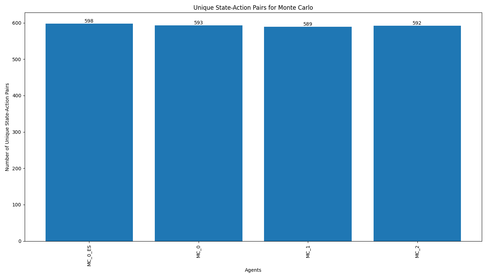

#### &epsilon; = 1/k and Exploring Starts

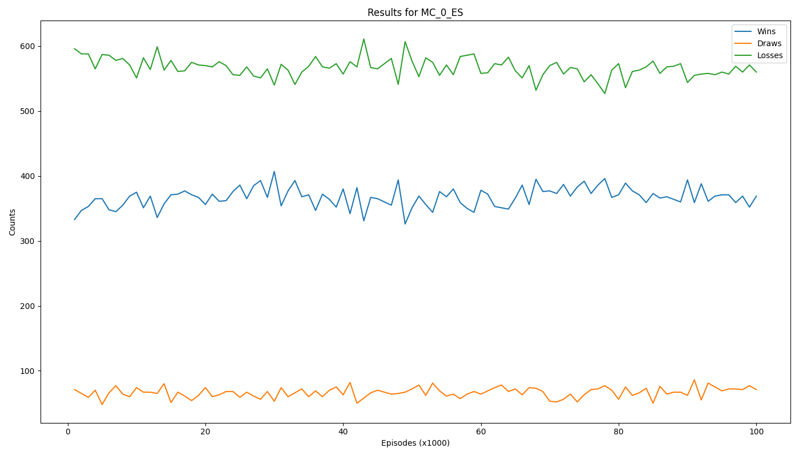


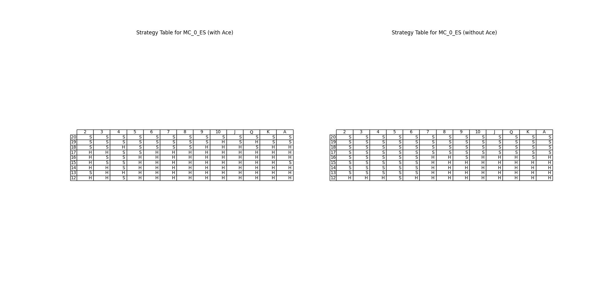

#### &epsilon; = 1/k

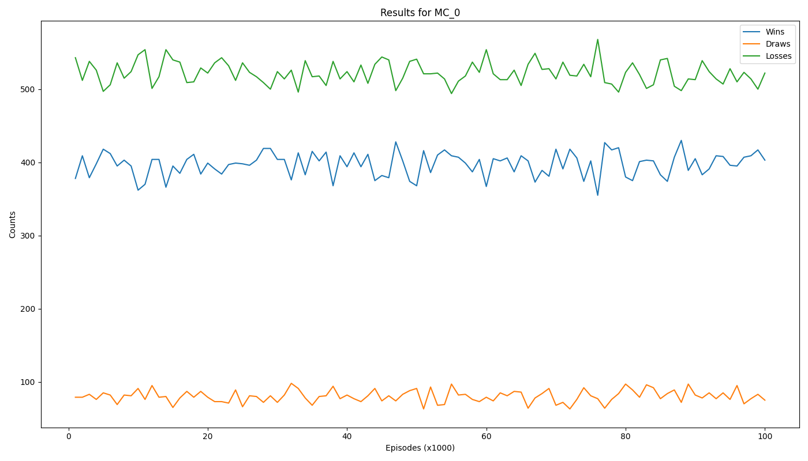

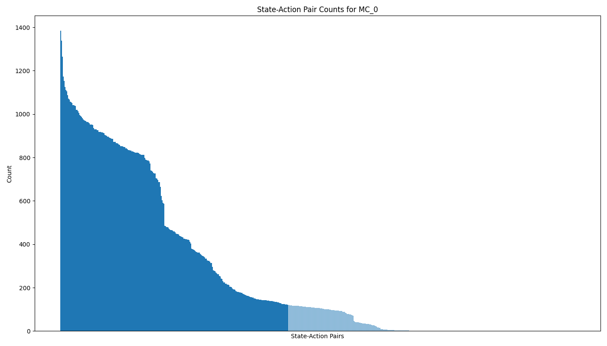


#### &epsilon; = e^-k/1000

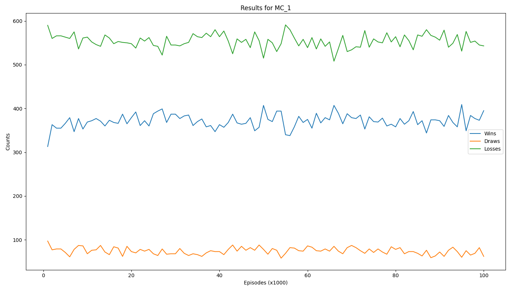

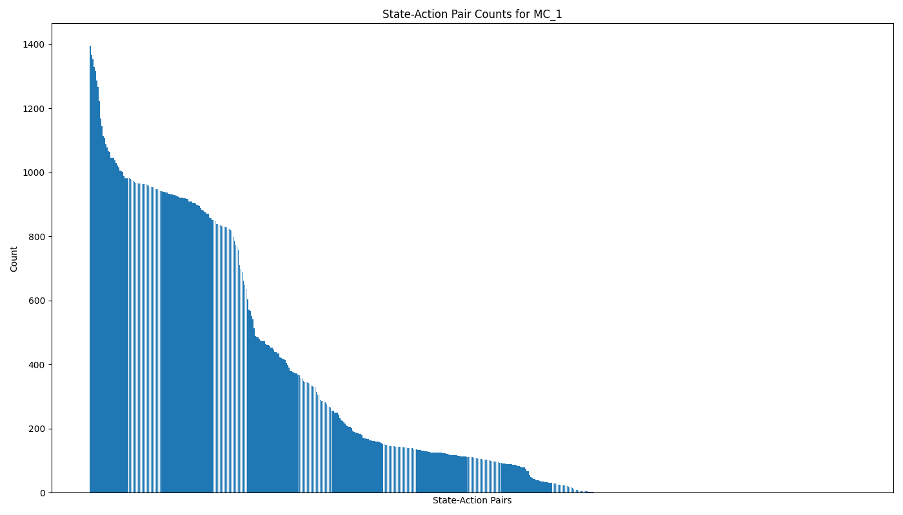


#### &epsilon; = e^-k/10000


### SARSA

#### Unique State Action Counts


#### &epsilon; = 0.1

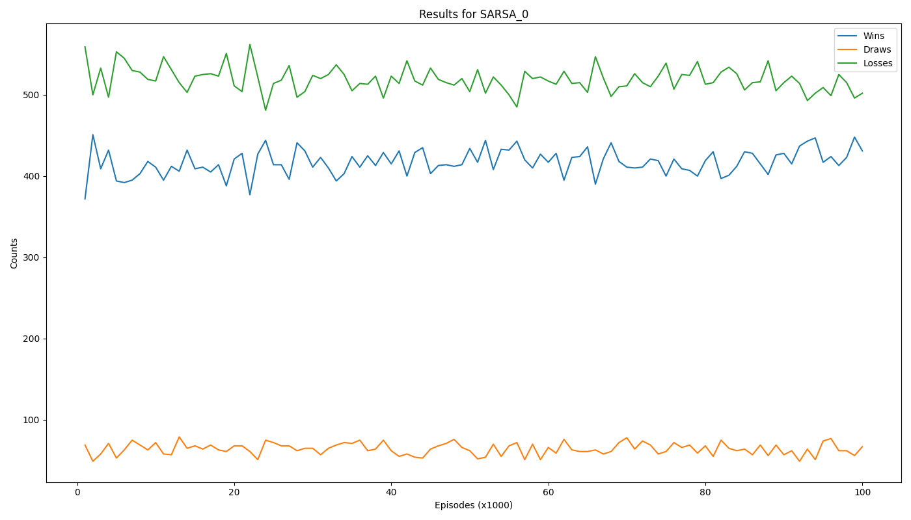


#### &epsilon; = 1/k


#### &epsilon; = e^-k/1000

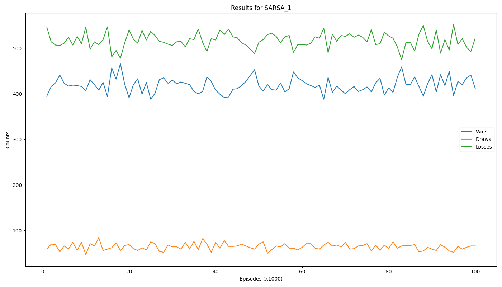


#### &epsilon; = e^-k/10000

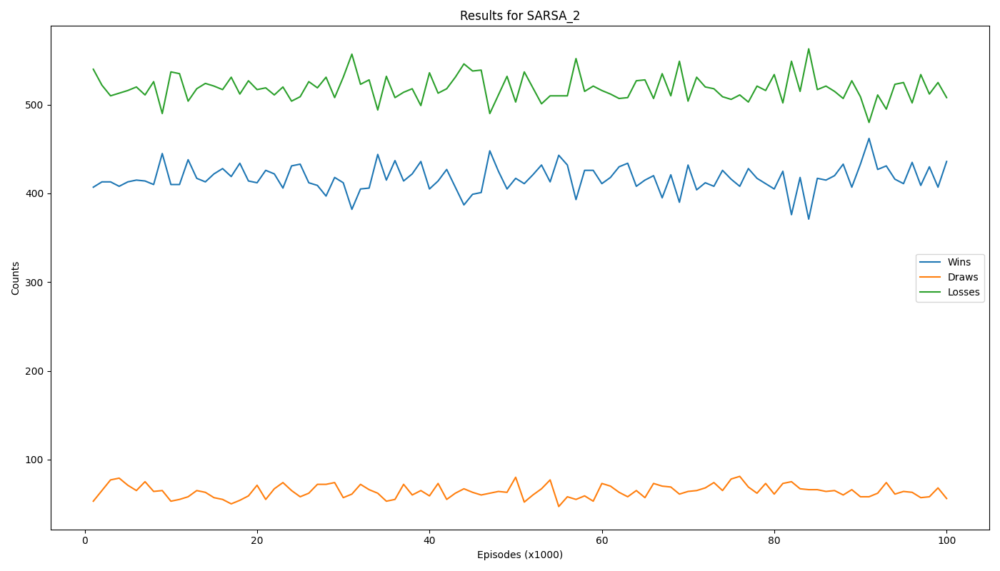

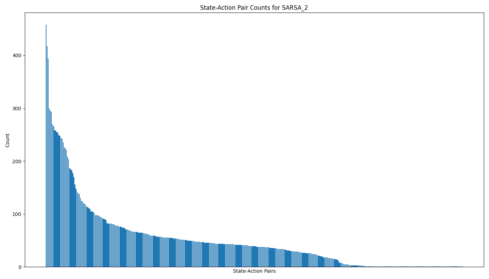


### Q Learning

#### Unique State Action Counts


#### &epsilon; = 0.1

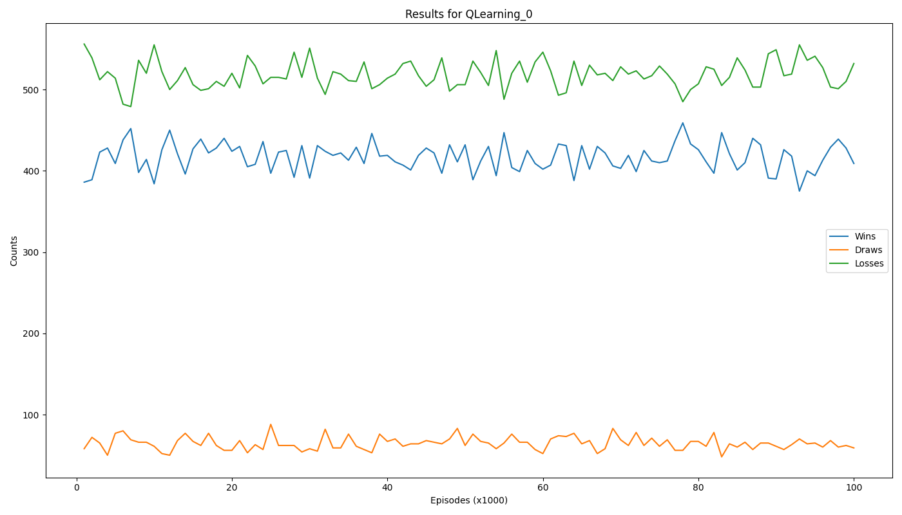


#### &epsilon; = 1/k


#### &epsilon; = e^-k/1000

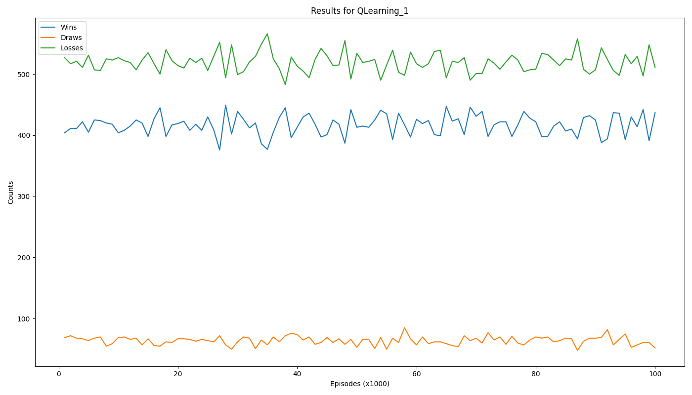


#### &epsilon; = e^-k/10000


#### Dealer Advantage

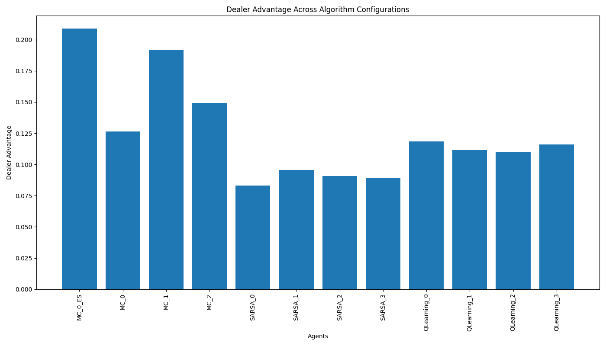

### Analysis

#### Exploration vs Exploitation

As was expected, Monte Carlo explored many more states than SARSA and QLearning, with exploring starts exploring the most of the 4 versions. However, what was not expected was that SARSA and QLearning both explored the exact same amount of states, the reason for this was not entirely clear from our analysis. As viewed in the state-action pair counts graphs, it is evident that QLearning and SARSA opted to exploit a few states at a much higher rate than others. We hypothesise that these observations would change with more simulation runs and that the policy would converge towards the optimal policy.

The effects of exploration are evident in our project since although Monte Carlo had a seemingly lower performance, it's strategy tables shows more variety than those of SARSA and QLearning. This indicates that 100000 rounds were not sufficient for any algorithm to converge towards a desired policy

#### Wins and Losses

It was observed that overall, SARSA and QLearning approaches outperformed Monte Carlo in terms of win percentage. This was observed from the results plot of each algorithm. It was also observed in the dealer advantage plots that SARSA slightly outperforms QLearning towards the end of the simulations.  
In terms of &epsilon; values, a lower epsilon score seemed to correlate towards a higher win percentage overall regardless of which algorithm was being used.

#### Strategies

For Monte Carlo the strategies seem a little all over the place, this is hypothesised to be due to a higher rate of exploration that the other 2 algorithms.

SARSA and QLearning opt to hit on anything that has a usable ace, while standing when the player hand value is greater than 17. This simple strategy further supports our hypothesis that the algorithms needed more time to converge towards the optimal policy.

#### Dealer Advantage

Algorithm wise, SARSA is the algorithm with the lowest average dealer advantage, next is QLearning and finally in last place is Monte Carlo Methods with a considerable worse average score.  
Of the SARSA implentations, an &epsilon; of 0.1 does the best of the 4.  
Despite SARSA being the best, due to the fact that both SARSA and QLearning are following the same strategy, this result is purely down to chance and it is difficult to say which of the algorithms actually minimizes dealer advantage.
